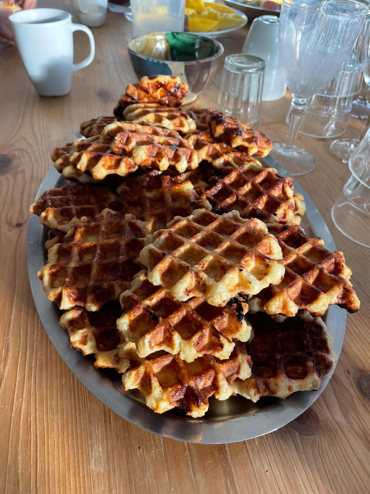

# Gaufres

Pour ~10 personnes (~20 gaufres rondes de ~8 cm de diamètre)

## Ingrédients

- 1 kg de farine
- 4 oeufs
- 20 cL d'eau
- 20 cL de lait
- 50 g de sucre en poudre
- 1 pincée de sel
- 1 cube de levure boulangère fraîche
- 500 g de beurre
- 500 g de sucre perlé

## Instructions

1. Mettre tout sauf le sucre perlé et le beurre dans un saladier, tout mélanger pour former une pâte
2. Faire fondre le beurre
3. Ajouter le beurre fondu à la pâte et malaxer le tout jusqu’à ce que la pâte aie "bu" tout le beurre
4. Laisser reposer et gonfler
    - Idéalement, laisser reposer dans un endroit plutôt chaud (au-dessus d’un radiateur par ex.)
    - Après ~1h30, "tabasser" la pâte pour la faire dégazer, cela permet de limiter l’odeur et le goût de la levure
    - Laisser reposer 1 nuit
5. Ajouter le sucre perlé et mélanger juste avant la cuisson
6. Pour la cuisson:
    - Faire plutôt des petites gaufre vu qu’elles sont assez nourrissantes
    - Utiliser un gaufrier graissé
    - Nettoyer les moules régulièrement pour éviter l’accumulation de caramel brûlé
    - Pour la durée de cuisson, je l’estime "à la couleur"
